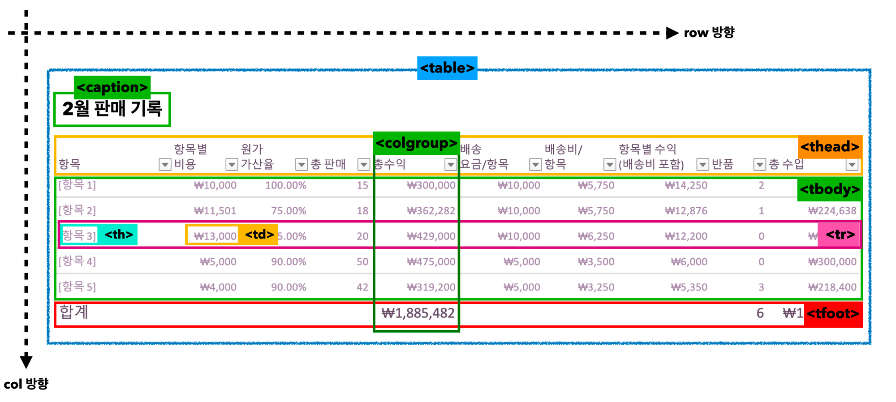

# ormi-2023-04-27

## What I have learned?

### HTML

- `<select>` 옵션 메뉴 제공
- `<option>`
	- `<optgroup>`
- `<fieldset>` 여러개의 폼을 하나로 묶고 제목까지 달고 싶을 때
	- `<legend>` 를 사용하여 제목설정 가능
- `<textarea>` 여러줄의 텍스트를 입력할 수 있는 거시기
	- `<input type="text">`와의 차이 => 예는 한 줄만 가능
	- 기본적으로 크기를 자유롭게 설정할 수 있지만, CSS를 사용하여 비활성화 할 수 있다.

### HTML TABLE

- table
	- tr : row
	- th : header : 테이블의 행,열, 제목
	- td: table data
	- colspan : 셀 병합 [img1](#img1)
		- `<th colspan="3">Something</th>` => 현재 커서로부터 3개의 열을 병합한 열을 만든다.
	- rowspan : 셀 병합 (여러개의 행을 감싸는 부모행)
		- `<th rowspan="2">Somethin</th>` => 현재 커서로부터 2개의 행을 병합한 행을 만든다.
	- caption
	- thead : 머리글 (표 상단에 있는 줄)
	- tbody : 몸통
	- tfoot : 바닥글 (표 하단에 있는 줄)
	- colgroup : 열 그룹 (여러개의 열을 감싸는 요소) [img2](#img2)
		- 사용할만한 데가 CSS 스타일링 밖에 없는데

### CSS

---

